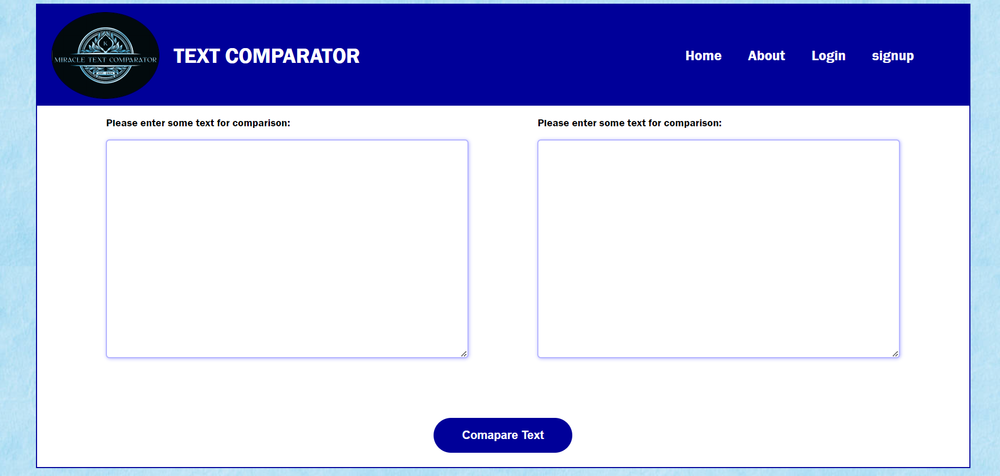

# Hi! I'm happy to see you here! 

# TEXT COMPARATOR TOOL
<strong>About Project :</strong>

Welcome to the Text Comparator Tool! This web application allows users to compare two text inputs and see the differences highlighted in real-time.

## Website

Link :https://miracletextcomparator.netlify.app

## Pages

### Home Page
- The home page is where users can start comparing texts by entering them into the designated text input fields.

### About Page
- The about page provides information about the purpose and functionality of the Text Comparator Tool.

### Login Page
- The login page allows registered users to access their accounts by entering their username and password.

### Signup Page
- The signup page is where new users can create an account by providing their name, email, and desired password.

## Technologies Used
- HTML
- CSS
- JavaScript

## Features
- Real-time text comparison
- User authentication for secured access
- User-friendly interface

## How to Run
1. Clone this repository to your local machine
2. Open the `index.html` file in your web browser
3. Start comparing texts!

## Contributors
- Karishma Wadaskar

### <u> Support :</u>

If you find my projects helpful or interesting, consider giving them a . It means a lot to me!